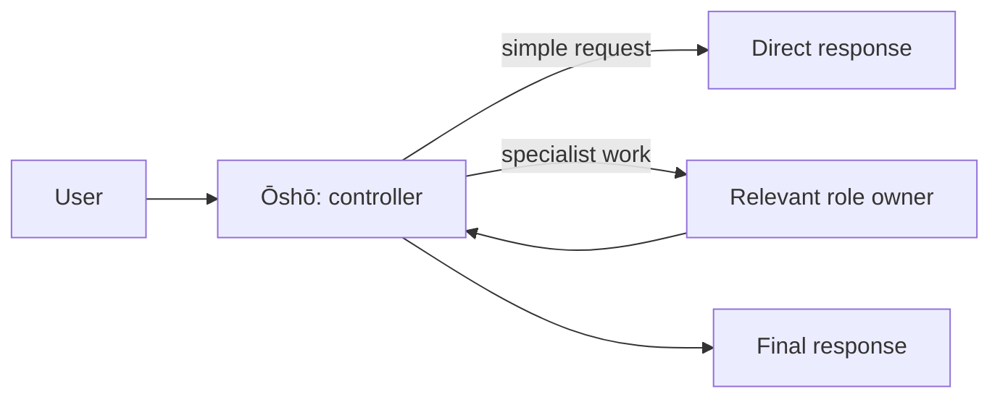

# Shogi

Shogi is a plain-Markdown multi-agent harness organized around shōgi roles.

It is not an SDK and it does not pretend Markdown is a runtime. The repository supplies readable contracts for roles and reusable capabilities, while host plugins provide the few hard runtime policies that need enforcement.

## Architecture

```text
system.md
    global routing, evidence, authority, and shared safety law

agents/*.md
    role identity and ownership boundaries

skills/*/SKILL.md
    portable capability procedures

plugins/
    host-enforced runtime behavior such as skill-mode routing and ambient response gadgets

manual_plugins/
    optional host integrations such as TencentDB Agent Memory
```

The layers are intentionally separate. A reusable skill should not need to know the Shogi board, internal agent names, or runtime mode policy.

## Why role separation?

A single agent can easily mix requirements, planning, execution, judgment, and presentation. The board separates those responsibilities so consequential work can use independent ownership without forcing ceremony on simple tasks.

- decisions and user communication stay with one controller;
- specialists contribute only within their role boundaries;
- evidence, execution, and validation remain independently owned;
- simple work can stay simple.



Ōshō is the only user-facing role. Specialists return bounded handoffs rather than addressing the user directly.

## The board

| Role | Responsibility |
| --- | --- |
| **Ōshō — King** | Sole user-facing controller. Preserves constraints, delegates when useful, and synthesizes grounded results. |
| **Kakugyō — Bishop** | Planning, decomposition, dependency ordering, and orchestration when sequencing adds value. |
| **Kinshō — Gold General** | Requirements, scope, acceptance criteria, constraints, and definition of done. |
| **Ginshō — Silver General** | Independent evidence-based validation using PASS / FAIL / UNVERIFIED. |
| **Hisha — Rook** | Clear presentation of accepted, evidence-grounded material. |
| **Kyōsha — Lance** | Read-only evidence gathering, repository inspection, and public-web research. |
| **Fuhyō — Pawn** | One bounded, checkable execution operation at a time. |
| **Keima — Knight** | Bounded adversarial challenge of risks, assumptions, continuity, or persona fidelity. |

## Skills

Skills are reusable capabilities. Their `SKILL.md` files describe **how to perform the capability**, not how this repository routes agents.

The default portability target is one skill directory. Sibling skills may be optional integrations, but a reusable skill should keep a complete semantic path of its own unless an external runtime/toolchain is intrinsically required. Compose through meaningful inputs, not repository-specific orchestration state.

Examples:

```text
Good: requires an approved behavior contract
Good: accepts a trusted vault descriptor
Good: accepts independent review evidence

Bad: requires an internal next-agent token
Bad: embeds a board executor identity
Bad: declares the host runtime mode inside the skill
Bad: consumes an opaque versioned envelope only another local skill can produce
```

Availability and execution of configured mode-managed JohnnyDecimal skills belong to the mode-router plugin.

### JohnnyDecimal layout

| Index | Prefix | Description |
| --- | --- | --- |
| 00 | `00-agent-` | Agentic utilities and persona/system helpers |
| 01 | `01-doc-` | Documentation and writing |
| 02 | `02-excalidraw-` | Excalidraw diagramming |
| 03 | `03-kb-` | Knowledge-base capabilities |
| 04 | `04-git-` | Git and version control |
| 05 | `05-dev-` | Development methodology and review |
| 06 | `06-python-` | Python-specific capabilities |
| 07 | `07-opencti-` | Reserved for OpenCTI capabilities |
| 08 | `08-openaev-` | Reserved for OpenAEV capabilities |
| 09 | `09-rp-` | Roleplay chatbot |
| 10 | `10-rpg-` | Reserved for general pen-and-paper RPG capabilities |
| 11 | `11-shadowrun-` | Reserved for Shadowrun RPG capabilities |
| 12 | `12-bbounty-` | Bug bounty and authorized security testing |
| 97 | `97-gadget-` | Optional response gadgets |
| 98 | `98-external-` | Imported/external helper capabilities |
| 99 | `99-tool-` | General tools and utilities |

## Runtime modes

Persisted session mode and the availability and execution of configured managed JohnnyDecimal skills are enforced by `plugins/mode-router-v2`.

The router owns the mode names, child-session inheritance, managed skill patterns, persisted session state, and `/mode` command. Native/system/harness tools and board-subagent availability are outside its authority and remain governed by host permissions and agent contracts. Skills and agent contracts do not duplicate managed skill-mode rules.

Edit `plugins/mode-router-v2/modes.yml` when the runtime skill families change.

The router targets the OpenCode V2 beta pre-model `context` hook and enforces configured managed JohnnyDecimal skill policy before every model dispatch, not merely when a `/mode` command is issued. It filters those managed skills from catalog advertisements and guards explicit JohnnyDecimal `/skill-id` invocation, `skill`-carrier calls that name a managed JohnnyDecimal skill, and direct managed JohnnyDecimal tool invocation. If request or session identity cannot be resolved, only configured managed JohnnyDecimal skills fail closed; the native tool surface never does. Native/system/harness tools and board subagents remain untouched by the router. Child subagent sessions inherit their parent session's mode.

## Ambient response gadgets

`plugins/response-gadgets-v2` owns the occasional Fun Fact, News, and SRS selections. The three gadget skills remain ordinary portable capabilities; they do not contain their own probability gates or know which agent selected them.

Selection is evaluated once per eligible user turn, survives tool-continuation requests without rerolling, and never creates a second synthetic assistant turn. Gadget appendices use generic `otsumi-ephemeral` markers so TencentDB capture can exclude ambient display-only material from durable memory.

The default ambient policy is enabled for ordinary work modes and suppressed for locked chatbot/gamemaster modes so a random out-of-character appendix cannot violate persona or narration format. The plugin accepts an explicit mode override when a deployment wants different ambient behavior; manual gadget invocation remains independent of the random selector.

## Obsidian

Obsidian topology is configuration, not global system law.

`03-kb-obsidian-vault-overview` is the authority for configured vault roots, root groups, templates, conventions, and vault safety metadata. Other Obsidian skills consume that configuration rather than hardcoding the vault layout.

## Memory

Durable memory is provided by [TencentDB-Agent-Memory](https://github.com/TencentCloud/TencentDB-Agent-Memory).

`manual_plugins/tencentdb-agent-memory/tencentdb` integrates it with OpenCode and adds the local dream workflow. Memory schema, retrieval, persistence, and retention belong to that infrastructure rather than to `system.md` or ordinary skills.

Obsidian knowledge and TencentDB memory are separate systems.

## Repository layout

- [system.md](system.md) — global system law and routing invariants.
- [agents/](agents/) — the eight role contracts.
- [skills/](skills/) — reusable capabilities at `skills/<name>/SKILL.md`.
- [plugins/](plugins/) — automatically loaded OpenCode plugins / hard guardrails.
- [manual_plugins/](manual_plugins/) — optional integrations that must be configured explicitly.
- [sample-opencode.json](sample-opencode.json) — example OpenCode configuration.

## Install

Clone the repository:

```bash
git clone git@github.com:Kakudou/agentic-system.git ~/.agentic-system
```

### OpenCode

```bash
ln -s ~/.agentic-system/system.md ~/.config/opencode/AGENTS.md
ln -s ~/.agentic-system/agents ~/.config/opencode/agents
ln -s ~/.agentic-system/skills ~/.config/opencode/skills
ln -s ~/.agentic-system/plugins ~/.config/opencode/plugins
ln -s ~/.agentic-system/manual_plugins ~/.config/opencode/manual_plugins
```

The `plugins/` symlink provides the hard runtime plugins. Configure manual integrations separately in the OpenCode configuration as needed; see [sample-opencode.json](sample-opencode.json).

Set OpenCode V2's `default_agent` to `osho` (as in the sample configuration) so ordinary sessions enter through the repository's sole user-facing controller rather than the host's built-in primary agent.

Set `subagent_depth` to `2`. OpenCode V2 defaults to depth `1`, which lets a primary agent launch a subagent but would prevent Kakugyō from delegating bounded specialist work from its child session. Depth `2` permits exactly the Ōshō → Kakugyō → specialist shape used by this board; ordered per-agent `subagent` permission rules allow only the required Shōgi board IDs, so built-in/general agents are not a bypass around Fuhyō or the other ownership boundaries.

For TencentDB memory, map each Shogi agent to its own Tencent `agent_id`. Leave an agent unmapped rather than using a shared fallback unless shared memory identity is explicitly intended.

### Copilot

```bash
ln -s ~/.agentic-system/system.md ~/.copilot/copilot-instructions.md
ln -s ~/.agentic-system/agents ~/.copilot/agents
ln -s ~/.agentic-system/skills ~/.copilot/skills
```

Host-specific delegation adapters remain the host's responsibility.

## Design principles

- **One public voice.** Ōshō owns user-facing communication and final synthesis.
- **One owner per concern.** Requirements, planning, execution, validation, research, challenge, and presentation remain distinct.
- **Portable skills.** Capability procedures do not depend on this board or its runtime mode implementation.
- **Evidence over assertion.** Never convert plans, expectations, or missing evidence into observed success.
- **Runtime policy in runtime code.** Hard enforcement such as skill modes belongs to plugins, not prose duplicated across skills.
- **Configuration has an owner.** Obsidian topology belongs to the vault-overview skill; durable memory belongs to TencentDB.
- **Plain contracts.** Keep the repository inspectable and understandable without hidden workflow schemas.
