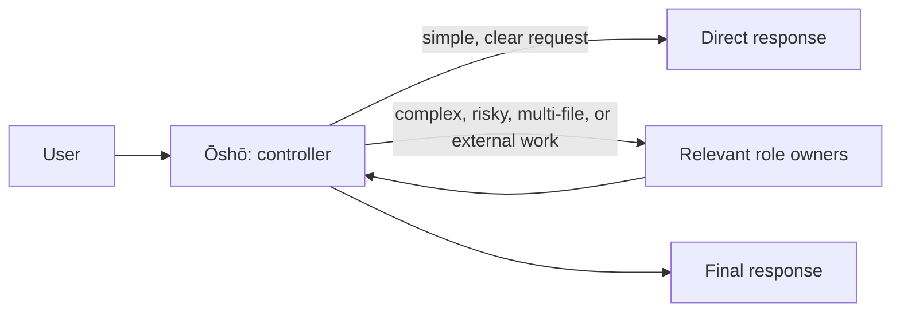

# Shogi

Shogi is a plain markdown multi-agent harness organized around shogi roles.

It is not an SDK or a runtime service.
That version is expressed through markdown and so it's portable and can be used in any environment that supports markdown.

## Why role separation ?

A single agent can easily mix up asking, planning, editing, judging and presenting. 
This can lead to confusion and errors in the output. 
By separating these roles, we can ensure that each agent is focused on a specific task, leading to more accurate and reliable results.
This also allows to use different models to confront each other and to have a more robust system.

- decisions and user communication stay with one controller agent
- specialists contribute only within their assigned boundaries
- evidence, execution, and validation reman independently owned
- simple work avoids unnecessary ceremony, while consequential work is organized in a structured way



Ōshō is the only user-facing role. Specialists do not address users or orchestrate one another.

## The board

| Role | Responsibility |
|---|---|
| **Ōshō** — King | Sole user-facing controller. Selects mode, preserves constraints, delegates work, and synthesizes accepted results. |
| **Kakugyō** — Bishop | Planning and dependent sequencing when they add value. |
| **Kinshō** — Gold General | Requirements, scope, acceptance criteria, and fairness. |
| **Ginshō** — Silver General | Independent validation of evidence, rules, rewards, and canon. |
| **Hisha** — Rook | Clear presentation of accepted, evidence-grounded material. |
| **Kyōsha** — Lance | Read-only evidence gathering, repository inspection, and public-web research. |
| **Fuhyō** — Pawn | One bounded, checkable execution operation at a time. |
| **Keima** — Knight | A bounded challenge of risk, fairness, continuity, or persona fidelity. |

## Repository layout

- [system.md](system.md) — Shared system contract, modes, routing, and safety boundaries.
- [agents/](agents/) — The eight role contracts.
- [skills/](skills/) — Individual capability contracts at `skills/<name>/SKILL.md`.
- [plugins/](plugins/) — Optional plugin at `plugins/<name>`, mostly hard guardrails.


## Install

Clone with submodules so the prompt-master contract is available:

```bash
git clone --recurse-submodules git@github.com:Kakudou/agentic-system.git ~/.agentic-system
```

If you cloned without submodules, repair the checkout with:

```bash
git -C ~/.agentic-system submodule update --init --recursive
```

`system.md` is the global instruction file. Link it, the agents directory, and the skills directory separately.

### OpenCode

```bash
ln -s ~/.agentic-system/system.md ~/.config/opencode/AGENTS.md
ln -s ~/.agentic-system/agents ~/.config/opencode/agents
ln -s ~/.agentic-system/skills ~/.config/opencode/skills
ln -s ~/.agentic-system/plugins ~/.config/opencode/plugins
```

### Copilot

Copilot’s mapping also needs the delegation adapter because it uses `task` and `read_agent`.

```bash
ln -s ~/.agentic-system/system.md ~/.copilot/copilot-instructions.md
ln -s ~/.agentic-system/agents ~/.copilot/agents
ln -s ~/.agentic-system/skills ~/.copilot/skills
ln -s ~/.agentic-system/plugins ~/.copilot/plugins
```
## Design principles

- **One public voice.** Ōshō owns user-facing communication and final synthesis.
- **Bounded authority.** Specialists contribute within their roles instead of taking over adjacent concerns.
- **Evidence over assertion.** Results should distinguish verified facts, unavailable capabilities, uncertainty, and remaining risk.
- **Appropriate process.** Escalate when complexity or consequences warrant it; do not perform board ceremony for a trivial request.
- **Plain Markdown.** The harness is a set of readable, inspectable contracts rather than a claimed runtime platform.


